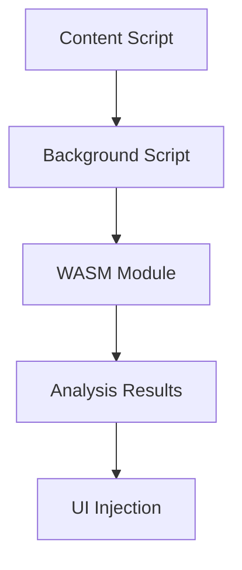

# Diagrams

This folder contains architecture and flow diagrams for the SquareX browser extension project. All diagrams are created using Mermaid and can be exported to PNG and SVG formats.

## Available Diagrams

### **Architecture Overview**
- **File**: [`architecture-overview.md`](architecture-overview.md)
- **Description**: High-level project architecture showing component relationships
- **Shows**: Browser extensions, core components, build system, and development tools

### **WASM Module Architecture**
- **File**: [`wasm-module-architecture.md`](wasm-module-architecture.md)
- **Description**: Internal structure of the Rust WASM analysis module
- **Shows**: Analysis algorithms, utilities, data structures, and JavaScript interface

### **Browser Extension Workflow**
- **File**: [`extension-workflow.md`](extension-workflow.md)
- **Description**: Sequence diagram of file upload processing
- **Shows**: User interaction, content script, background script, and WASM analysis flow

### **Build Pipeline**
- **File**: [`build-pipeline.md`](build-pipeline.md)
- **Description**: Build process and dependency flow
- **Shows**: Source code, build tools, outputs, and package management

## Diagram Types

### Architecture Diagrams
- **System Overview**: High-level system architecture
- **Component Architecture**: Detailed component relationships
- **Browser Extension Architecture**: Extension-specific architecture
- **WASM Integration**: WebAssembly module integration

### Flow Diagrams
- **File Upload Flow**: Complete file upload and analysis flow
- **Analysis Pipeline**: Step-by-step analysis process
- **Cross-browser Communication**: Message passing between components
- **Error Handling Flow**: Error scenarios and handling

### Sequence Diagrams
- **Extension Initialization**: Extension startup sequence
- **File Analysis Process**: WASM analysis sequence
- **UI Update Flow**: User interface update sequence
- **Browser Communication**: Extension-browser communication

## File Formats

Diagrams are stored in multiple formats for different use cases:
- **Mermaid**: Source files for version control and editing
- **PNG**: High-resolution images for documentation
- **SVG**: Scalable vector graphics for web display
- **PDF**: Print-ready documentation

## Diagram Structure

```
diagrams/
├── architecture/     # System and component architecture
│   ├── system-overview.mmd
│   ├── component-architecture.mmd
│   └── wasm-integration.mmd
├── flows/           # Process and data flows
│   ├── file-upload-flow.mmd
│   ├── analysis-pipeline.mmd
│   └── error-handling.mmd
├── sequences/       # Sequence diagrams
│   ├── extension-init.mmd
│   ├── file-analysis.mmd
│   └── ui-update.mmd
├── browser-specific/ # Browser-specific diagrams
│   ├── chrome-architecture.mmd
│   ├── firefox-architecture.mmd
│   └── safari-architecture.mmd
└── exports/         # Generated images and PDFs
    ├── png/
    ├── svg/
    └── pdf/
```

## Exporting Diagrams

### **Prerequisites**
Install the Mermaid CLI tool:
```bash
npm install -g @mermaid-js/mermaid-cli
```

### **Export All Diagrams**
```bash
./diagrams/export-diagrams.sh
```

This will generate:
- **PNG files**: `diagrams/png/`
- **SVG files**: `diagrams/svg/`

### **Manual Export**
Export individual diagrams:
```bash
# Extract Mermaid code from markdown
awk '/```mermaid/,/```/' diagrams/architecture-overview.md | grep -v '```' > temp.mmd

# Export to PNG
mmdc -i temp.mmd -o diagrams/png/architecture-overview.png

# Export to SVG
mmdc -i temp.mmd -o diagrams/svg/architecture-overview.svg

# Clean up
rm temp.mmd
```

## Viewing Diagrams

### **In Markdown**
The diagrams are embedded in markdown files and will render in:
- GitHub (native Mermaid support)
- GitLab (native Mermaid support)
- VS Code with Mermaid extension
- Other markdown viewers with Mermaid support

### **As Images**
After exporting, you can view the generated PNG/SVG files in any image viewer or include them in documentation.

### Mermaid Syntax

Example Mermaid diagram structure:


## Documentation Integration

Diagrams are integrated into:
- **README.md**: System overview and architecture
- **docs/analysis.md**: Technical analysis documentation
- **Component READMEs**: Component-specific documentation
- **API Documentation**: Interface and flow documentation

## Diagram Maintenance

### **Adding New Diagrams**
1. Create a new `.md` file in the `diagrams/` folder
2. Use the Mermaid syntax with proper documentation
3. Update this README to include the new diagram
4. Run the export script to generate images

### **Updating Diagrams**
1. Modify the Mermaid code in the `.md` file
2. Run the export script to regenerate images
3. Update any documentation that references the diagrams

### **Best Practices**
- Use descriptive names for diagram files
- Include clear documentation for each diagram
- Use consistent styling and colors
- Keep diagrams focused and readable
- Update diagrams when architecture changes

## Version Control
- Mermaid source files are version controlled
- Generated images are excluded from version control
- Diagram updates are part of code review process

## Browser-Specific Diagrams

### Chrome (Manifest V3)
- Service worker architecture
- Content script isolation
- WASM loading in service workers

### Firefox (WebExtensions)
- Background script persistence
- Content script communication
- WASM integration patterns

### Safari (App Extensions)
- Native app integration
- Content script limitations
- WASM security model

## Performance Considerations

Diagrams include:
- **Performance bottlenecks**: Identified performance issues
- **Optimization opportunities**: Areas for improvement
- **Memory usage patterns**: Memory allocation and cleanup
- **Processing pipelines**: Data flow optimization
