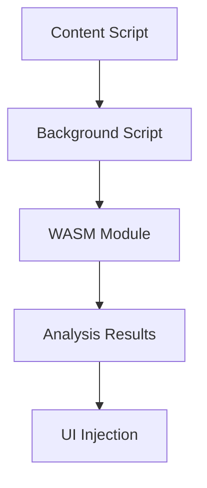

# Diagrams

Architecture diagrams, flow charts, and visual documentation for the SquareX browser extension project.

## Overview

This directory contains visual documentation including architecture diagrams, sequence diagrams, and flow charts that help understand the system design and data flow.

## Diagram Types

### Architecture Diagrams
- **System Overview**: High-level system architecture
- **Component Architecture**: Detailed component relationships
- **Browser Extension Architecture**: Extension-specific architecture
- **WASM Integration**: WebAssembly module integration

### Flow Diagrams
- **File Upload Flow**: Complete file upload and analysis flow
- **Analysis Pipeline**: Step-by-step analysis process
- **Cross-browser Communication**: Message passing between components
- **Error Handling Flow**: Error scenarios and handling

### Sequence Diagrams
- **Extension Initialization**: Extension startup sequence
- **File Analysis Process**: WASM analysis sequence
- **UI Update Flow**: User interface update sequence
- **Browser Communication**: Extension-browser communication

## File Formats

Diagrams are stored in multiple formats for different use cases:
- **Mermaid**: Source files for version control and editing
- **PNG**: High-resolution images for documentation
- **SVG**: Scalable vector graphics for web display
- **PDF**: Print-ready documentation

## Diagram Structure

```
diagrams/
├── architecture/     # System and component architecture
│   ├── system-overview.mmd
│   ├── component-architecture.mmd
│   └── wasm-integration.mmd
├── flows/           # Process and data flows
│   ├── file-upload-flow.mmd
│   ├── analysis-pipeline.mmd
│   └── error-handling.mmd
├── sequences/       # Sequence diagrams
│   ├── extension-init.mmd
│   ├── file-analysis.mmd
│   └── ui-update.mmd
├── browser-specific/ # Browser-specific diagrams
│   ├── chrome-architecture.mmd
│   ├── firefox-architecture.mmd
│   └── safari-architecture.mmd
└── exports/         # Generated images and PDFs
    ├── png/
    ├── svg/
    └── pdf/
```

## Tools and Workflow

### Diagram Creation
- **Mermaid**: Primary diagram format for version control
- **Draw.io**: Alternative for complex diagrams
- **PlantUML**: For UML-style diagrams

### Generation Commands

```bash
# Generate PNG images from Mermaid files
npm run diagrams:generate:png

# Generate SVG images from Mermaid files
npm run diagrams:generate:svg

# Generate PDF documentation
npm run diagrams:generate:pdf

# Watch for changes and regenerate
npm run diagrams:watch
```

### Mermaid Syntax

Example Mermaid diagram structure:


## Documentation Integration

Diagrams are integrated into:
- **README.md**: System overview and architecture
- **docs/analysis.md**: Technical analysis documentation
- **Component READMEs**: Component-specific documentation
- **API Documentation**: Interface and flow documentation

## Maintenance

### Version Control
- Mermaid source files are version controlled
- Generated images are excluded from version control
- Diagram updates are part of code review process

### Update Process
1. Modify Mermaid source files
2. Regenerate images using build scripts
3. Update documentation references
4. Review changes in pull request

## Browser-Specific Diagrams

### Chrome (Manifest V3)
- Service worker architecture
- Content script isolation
- WASM loading in service workers

### Firefox (WebExtensions)
- Background script persistence
- Content script communication
- WASM integration patterns

### Safari (App Extensions)
- Native app integration
- Content script limitations
- WASM security model

## Performance Considerations

Diagrams include:
- **Performance bottlenecks**: Identified performance issues
- **Optimization opportunities**: Areas for improvement
- **Memory usage patterns**: Memory allocation and cleanup
- **Processing pipelines**: Data flow optimization
