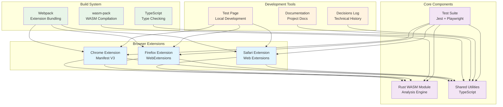

# Architecture Overview

This diagram shows the high-level architecture of the SquareX browser extension project.

## Component Relationships

- **Browser Extensions**: Platform-specific implementations using shared utilities and WASM module
- **Core Components**: Reusable code and analysis engine
- **Build System**: Tools for compiling and bundling the project
- **Development Tools**: Supporting infrastructure for development and documentation
