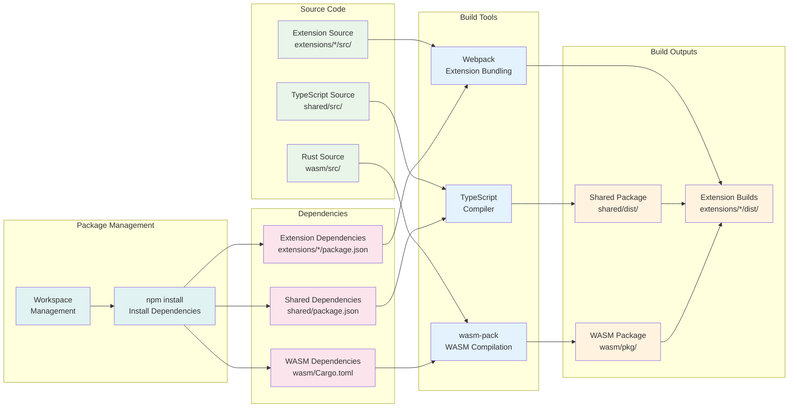

# Build Pipeline

This diagram shows the build process for the SquareX browser extension project.



## Build Process

### **1. Dependency Installation**
```bash
npm install
```
- Install all workspace dependencies
- Resolve local package dependencies

### **2. WASM Module Build**
```bash
cd wasm && wasm-pack build --target web
```
- Compile Rust source to WebAssembly
- Generate TypeScript bindings
- Output: `wasm/pkg/` directory

### **3. Shared Package Build**
```bash
cd shared && npm run build
```
- Compile TypeScript source
- Generate type definitions
- Output: `shared/dist/` directory

### **4. Extension Builds**
```bash
cd extensions/chrome && npm run build
cd extensions/firefox && npm run build
cd extensions/safari && npm run build
```
- Bundle extension source with Webpack
- Include shared utilities and WASM module
- Output: `extensions/*/dist/` directories

### **5. Build Dependencies**
- Extensions depend on shared package
- Extensions depend on WASM module
- Shared package provides types and utilities
