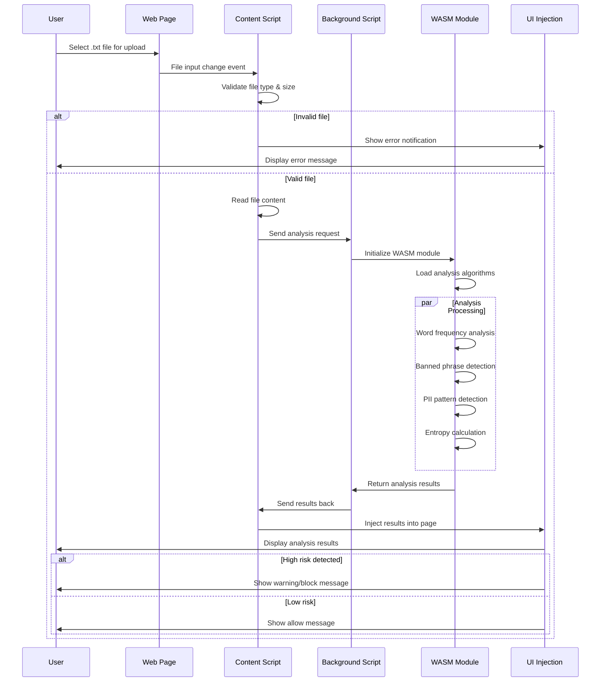

# Browser Extension Workflow

This diagram shows the workflow of how the browser extension processes file uploads.

## Workflow Steps

### **1. File Selection**
- User selects a `.txt` file for upload
- Content script detects file input change event

### **2. Validation**
- Check file type (must be `.txt`)
- Validate file size (max 100MB)
- Show error if validation fails

### **3. Analysis Request**
- Read file content as text
- Send analysis request to background script
- Background script initializes WASM module

### **4. Parallel Analysis**
- **Word Frequency**: Identify top words
- **Banned Phrases**: Detect prohibited content
- **PII Detection**: Find personal information
- **Entropy Calculation**: Measure text randomness

### **5. Results Processing**
- WASM returns structured analysis results
- Background script processes and formats results
- Results sent back to content script

### **6. UI Update**
- Content script injects results into page
- Display analysis summary to user
- Show allow/block decision with reasoning
