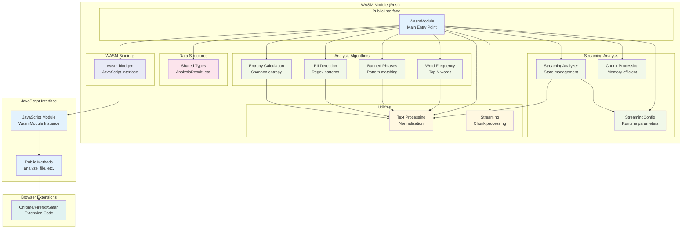

# WASM Module Architecture

This diagram shows the internal architecture of the Rust WASM module for file analysis.

## Module Components

### **Public Interface**
- **WasmModule**: Main entry point with WASM bindings
- **JavaScript Interface**: Exposed methods for browser extensions

### **Analysis Algorithms**
- **Word Frequency**: Identifies most common words in text
- **Banned Phrases**: Detects prohibited content patterns
- **PII Detection**: Finds personal identifiable information
- **Entropy Calculation**: Measures text randomness/obfuscation

### **Streaming Analysis**
- **StreamingAnalyzer**: Stateful analyzer for large file processing
- **StreamingConfig**: Runtime-configurable parameters (stopwords, thresholds, banned phrases)
- **Chunk Processing**: Memory-efficient processing of large files in 1MB chunks

### **Utilities**
- **Text Processing**: Normalization and cleaning functions
- **Streaming**: Chunk-based processing for large files

### **Data Structures**
- **Shared Types**: Common data structures for analysis results
